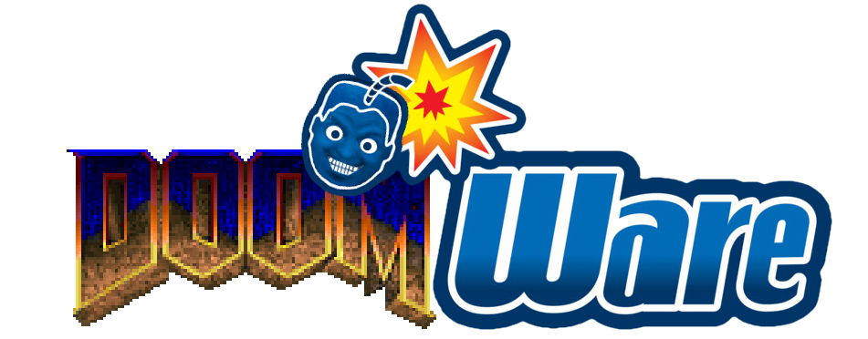

---

DoomWare is a fast paced, competitive multiplayer WAD for Zandronum. Similar to Nintendo's [WarioWare](https://www.mariowiki.com/WarioWare_(series)) series, the player is thrust into an arena where they are faced with a random selection of minigames that test all sorts of skills. As the game progresses, the minigames get faster and harder. But the games themselves are not your only obstacles, as you're competing against other players for the high score.

## Features
* Over 100 minigames
* Fully playable in singleplayer and multiplayer
* 2 Team support
* Wacky game modifiers
* Stat tracking
* Achievements
* Seasonal map skins
* Plenty of CVars for both players and servers
* Fully documented source code and Wiki
* Attempts at comedy
* Lore so complex that it'll overwhelm even the most die-hard Kingdom Hearts fan
* Great ways to lose friends
* Internet memes and references to WADs older than the average internet user
* Possible violations of the Geneva conventions

## Wiki
DoomWare's source code is fully commented, but I highly recommend checking out [the wiki](../../wiki) to learn more about the WAD, how to play it, configure it on servers, and even how to extend it!

## Credits
DoomWare is programmed entirely by [Buu342](https://github.com/buu342). It has a lot of assets from a lot of places, so if you want a fully detailed list of credits, music, etc..., then open the WAD with a lump editor such as [SLADE](https://slade.mancubus.net/) and check out the `CREDITS` lump.